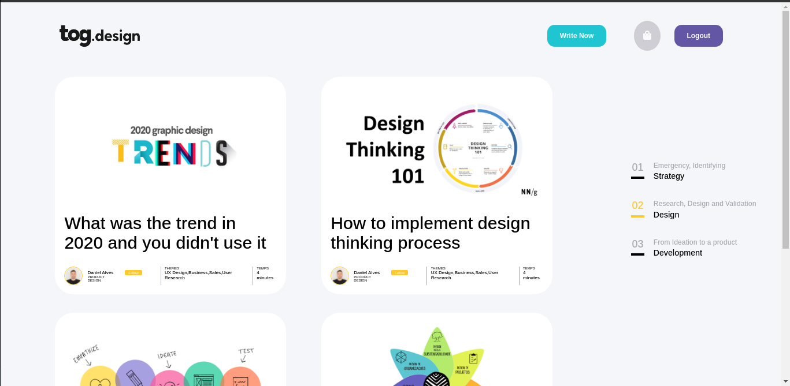
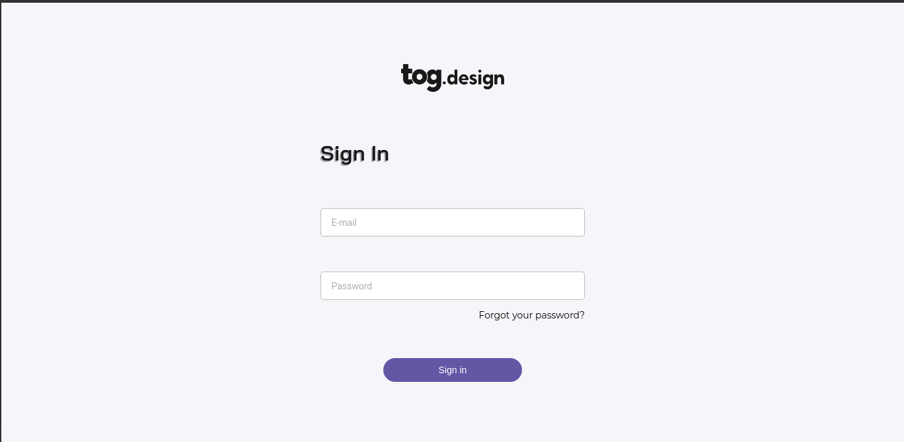
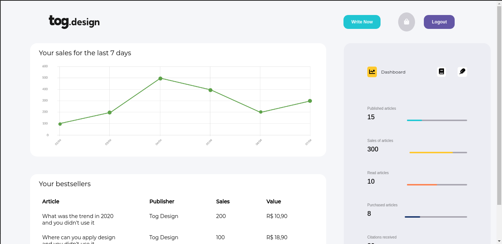
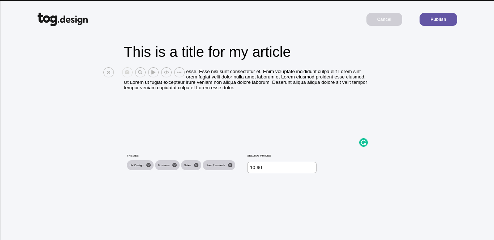

# Tog Design Test


## :thinking: What is that about?

This is a challenge project from [Tog Design](https://tog.design) developer team.

## 📷 Some screenshots
__Home page__
<p align="center">
 
</p>

__Sign In page__
<p align="center">
 
</p>

__Dashboard page__
<p align="center">
 
</p>

__Posting article with image__
<p align="center">
 
</p>

## ⭐ Objectives

- Get the challenge done.
- Use modern front-end concepts.
- Get hired! (of course)

## ⚛️ React.js concepts

- Apply HOC structure.
- Implement hooks from React and Next.
- Style with CSS Modules.
- Use controlled inputs.

## 💻 Technologies

This repo is based in:

- [Node.js](https://nodejs.org/)
- [Next.js](https://nextjs.org/)
- [Typescript](https://www.typescriptlang.org/)
- [Yarn](https://yarnpkg.com/)

## 📁 Libraries

- [Font Awesome](https://fontawesome.com/)
- [Axios](https://axios-http.com/)
- [bcryptjs](https://www.npmjs.com/package/bcryptjs)
- [js-cookie](https://www.npmjs.com/package/js-cookie)
- [date-fns](https://date-fns.org)
- [json-server](https://www.npmjs.com/package/json-server)
- [concurrently](https://www.npmjs.com/package/concurrently)
- [form-data](https://www.npmjs.com/package/form-data)

## 📋 Prototype

If you want to see the prototype of this project, [click here](https://xd.adobe.com/view/424dc0f2-ed3d-4cd5-97bc-bc0379af3997-171e/). 


## 🚀 Getting Started

- Make sure the [back-end server](https://github.com/fabiobends/back-end-togdesign-test) is beforehand running.

- Run this development server (front-end):

```bash
# for npm users
npm install
# then 
npm run dev

# for yarn users
yarn
# then
yarn dev
```

- Open [http://localhost:3000](http://localhost:3000) with your browser to see the result.

Made with :heart: 👨🏻‍💻